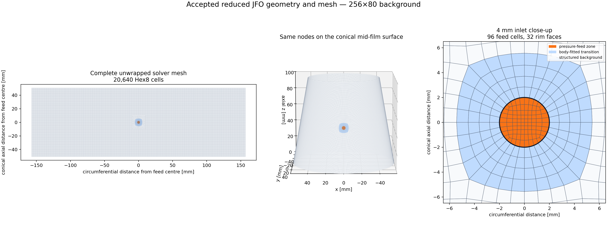

#+TITLE: Bearing CFD
#+SUBTITLE: Geometry, meshing, and lubrication models for an eccentric conical journal bearing
#+UPDATED_AT: [2026-08-02 Sun]
#+STARTUP: overview
#+OPTIONS: toc:2 num:nil

* Overview

Bearing CFD contains the geometry, mesh generators, format converters, and
lubrication solvers used to study an eccentric conical journal bearing with a
central pressure feed.

The geometry is defined in millimetres with the bearing axis along global
=Z=.  Meshing code converts coordinates to metres before writing solver files.
The repository includes both a Python Reynolds--JFO model and an independent
OpenFOAM implementation.

#+CAPTION: Conical-film geometry, central-feed topology, and mesh-quality diagnostics.
#+ATTR_ORG: :width 1100

* Implemented methods

| Area | Implementation |
|---+---|
| Geometry | OCCT fluid-volume construction, radial and normal-clearance checks, native BREP and STEP round trips |
| Meshing | surface smoke mesh, no-port Hex8, surface-inlet Hex8, body-fitted Hex8, and central-feed Prism6 |
| Interchange | MSH 4.1, MSH 2.2 ASCII, CGNS, and Fluent legacy ASCII with topology and scale audits |
| Lubrication | Python Reynolds--JFO model and native OpenFOAM =jfoBearingFoam= solver |
| Studies | single-phase commissioning, guarded speed continuation, JFO comparisons, and four cavitation/rupture mechanisms |

The four-model comparison is documented in
[[file:docs/studies/conical-journal/cavitation-model-comparison.org][Cavitation and film-rupture model comparison]].
A presentation version is available as
[[file:docs/cavitation-model-discussion.pdf][PDF]].

* Installation

The project uses [[https://docs.astral.sh/uv/][uv]] and Python 3.10--3.13.

#+begin_src sh
git clone git@github.com:aniketnegi/bearing-cfd.git
cd bearing-cfd
uv sync --locked
#+end_src

Show the installed commands:

#+begin_src sh
uv run bearing-cfd --help
#+end_src

* Quick checks

The default tests use tracked fixtures and do not read =out/=.

#+begin_src sh
uv run pytest
uv run ruff check bearing_cfd studies tests
#+end_src

Mesh-generating tests are marked as integrations:

#+begin_src sh
uv run pytest -m integration
#+end_src

The native OpenFOAM solver has a separate build and zero-speed smoke check:

#+begin_src sh
bash openfoam/check_jfoBearingFoam.sh
#+end_src

See [[file:docs/tutorials/first-run.org][First run]] for a guided installation and
simulation, or [[file:docs/operations/running-and-testing.org][Running and testing]]
for individual stage commands.

* Command-line interface

#+begin_example
bearing-cfd conical-journal geometry [options]
bearing-cfd conical-journal mesh <method> [options]
bearing-cfd conical-journal export central-feed [options]
bearing-cfd conical-journal simulate reynolds-jfo [options]
#+end_example

Use =--help= after a complete command to inspect its arguments, for example:

#+begin_src sh
uv run bearing-cfd conical-journal simulate reynolds-jfo --help
#+end_src

Repository-local studies are direct scripts under =studies/conical_journal/=.
They are kept outside the installed command because their inputs and retained
artifacts belong to a particular checkout.

Generated files use =out/conical_journal/<stage>/...=.  Successful generations
include =run.json= with the resolved inputs, producing source revision, tool
versions, upstream hashes, output hashes, and acceptance status.

** CAD exchange status

The default native BREP geometry passes its geometry and round-trip checks and
is published for meshing.  STEP re-import exceeds the strict relative-volume
tolerance at the feed intersection, so STEP is recorded as =REJECTED= and is
excluded from the published geometry directory.  Use =--retain-failed-step= to
keep the rejected files in a separate =default.rejected-step/= directory for
inspection.

* Repository layout

| Path | Contents |
|---+---|
| [[file:bearing_cfd/bearings/conical_journal/geometry/][=bearing_cfd/.../geometry/=]] | parameter model and OCCT construction |
| [[file:bearing_cfd/bearings/conical_journal/meshing/][=bearing_cfd/.../meshing/=]] | conical-bearing mesh generators |
| [[file:bearing_cfd/bearings/conical_journal/simulation/][=bearing_cfd/.../simulation/=]] | Python JFO solver and surface-mesh adapter |
| [[file:bearing_cfd/interchange/][=bearing_cfd/interchange/=]] | CGNS and Fluent format adapters |
| [[file:openfoam/][=openfoam/=]] | native solver and smoke-check script |
| [[file:cases/conical_journal/openfoam/][=cases/=]] | compact OpenFOAM reference cases |
| [[file:studies/conical_journal/][=studies/=]] | executable study drivers and input dictionaries |
| [[file:tests/][=tests/=]] | unit tests, integration tests, and compact fixtures |
| [[file:evidence/conical_journal/][=evidence/=]] | selected plots, animations, and result ledgers |
| [[file:docs/][=docs/=]] | tutorials, procedures, reference, explanations, and study notes |

* Results and limitations

The [[file:docs/openfoam-single-phase-report.pdf][OpenFOAM single-phase results
report]] presents the full-mesh 2000 rpm solution, derived bearing quantities,
and a compact cross-check against the teammate Fluent run.

| Result | Current state |
|---+---|
| Full 3-D body-fitted mesh | 1,252,800 Hex8 cells; standard =checkMesh= passes; minimum Fluent-equivalent Orthogonal Quality 0.922660 |
| Solver-neutral export | static MSH/CGNS/Fluent-ASCII round trips pass; no live Fluent pass is recorded for the versioned evidence |
| Reynolds--JFO sweep | numerical gates pass from 0 to 4000 rpm; mesh independence and full pressure-curve validation remain open |
| Oil-vapour model | phase onset observed; convergence gate not met |
| Non-condensable-gas model | zero-speed conservation gate not met |
| Atmospheric-ventilation model | rejected after inadmissible negative absolute pressure during startup |

Numerical convergence does not establish physical validation.  The JFO sweep
still needs a consistent three-grid comparison and comparison with the full
experimental pressure distribution.  The three-dimensional cavitation model
also depends on unresolved lubricant, supply-pressure, and axial-boundary
conditions listed in the [[file:docs/studies/conical-journal/cavitation-model-comparison.org::*Open questions][study notes]].

* Documentation

The [[file:docs/index.org][documentation index]] separates tutorials, how-to
guides, reference material, explanations, and current study results.
