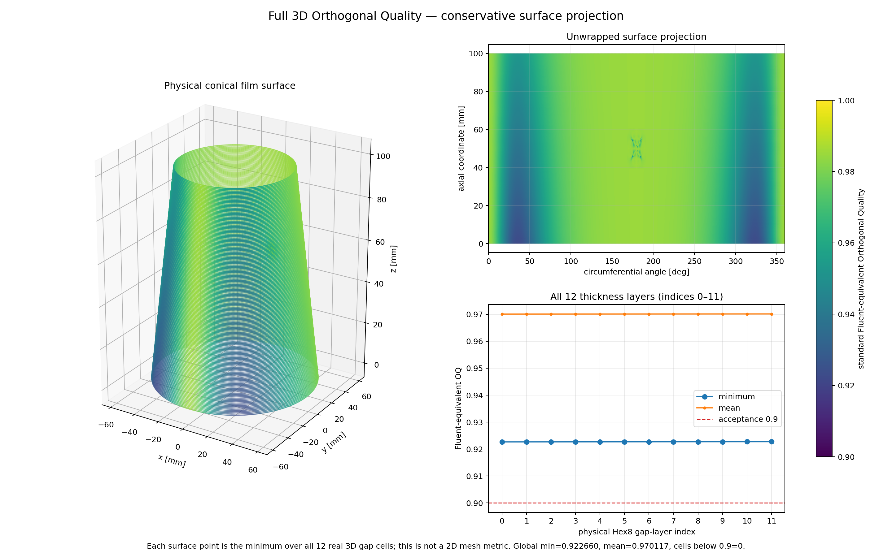

#+title: OpenFOAM Bearing CFD Handoff
#+updated_at: [2026-07-29 Wed]
#+startup: overview
#+options: toc:2 num:nil

[[file:01-openfoam-build.org][Next: OpenFOAM build]]

* Purpose

This is the complete handoff for the OpenFOAM work started on 2026-07-25.
It is split into small files so that a result, command, assumption, or failure
can be opened directly without searching one very large document.

The short conclusion is:

| Stage | Status | What it proved |
|---+---+---|
| OpenFOAM 14 source build | accepted | The solver and conversion tools run locally |
| S100 mesh import | accepted | The validated Hex8 mesh and five named boundaries survive conversion |
| Zero-flow case | accepted | Fields, patches, numerics, and solver plumbing are correct |
| 0 rpm, 0.5 MPa feed | accepted pressure-only commissioning case | A mass-balanced stationary pressure-driven state converges; it is not pure hydrodynamic |
| 200 rpm single-liquid case | rejected | It predicts pressure below absolute vacuum; the physical model is incomplete |
| Pressure-fed Schnerr-Sauer smoke test | exploratory and rejected | Mapping time 285 improved initialization, but phase and mass balance did not converge |
| 0 rpm, zero bias, cavitation active | accepted equilibrium | The exact zero-flow field survives the phase model without using time 285 |
| 1 rpm, zero bias | accepted continuation checkpoint | Rotation alone creates a bounded hydrodynamic field; no vapour forms at this low speed |
| 5 rpm, zero bias | accepted continuation checkpoint | Pressure, flow balance, and loads settle; pressure remains positive and no vapour forms |
| 10, 12, 14, and 15 rpm, zero bias | accepted continuation checkpoints | The low-speed liquid branch remains bounded, balanced, and above saturation |
| 20 rpm, zero bias | accepted continuation checkpoint | The liquid branch settles at ~p_min=1836.89 Pa~ with clean conservation and ~alpha.oil=1~ |
| First 20-to-50-rpm ramp update | guarded stop | At 20.2 rpm, ~p_min=-0.177 Pa < pSat~; this brackets the schedule-dependent saturation threshold but is not yet a cavity solution |
| Direct 10 to 15 rpm restart | rejected diagnostic | The discontinuous wall-speed update briefly crosses =pSat= and triggers a runaway phase/pressure feedback |
| Native 10 to 15 rpm =omega= ramp | accepted diagnostic | The same target speed is reached with Schnerr-Sauer active, =alpha.oil= equal to one, and clean continuity |
| Native Reynolds/JFO midsurface model through 2000 rpm | *unvalidated candidate* | Its active-set kernel passes a coarse published graph-consistency check, but the full conical model has a grid-dependent feed mask and its 64.455% severe rupture region is not physically validated |
| Body-fitted circular 3-D Fluent mesh | *static pass; Fluent not run* | 1,252,800 Hex8 cells in 12 thickness layers; standard Fluent-equivalent minimum OQ 0.922660 with zero cells below 0.9 |

The 200 rpm failure is useful evidence.  Rotation creates a low-pressure
diverging-film region.  A liquid-only CFD model tries to continue that
pressure below physical vacuum.  This is why the next question is not merely
"which solver setting is wrong?" but "what film-rupture physics represents
this oil and its dissolved or entrained gas?"

The current branch starts from the exact zero-flow field, fixes all three
openings at the same ambient absolute pressure, and activates cavitation at
0 rpm.  The 10-to-15-rpm audit showed that abrupt restart changes are the
numerical trigger.  Future speed changes therefore use OpenFOAM's native
continuous =omega= function followed by a constant-speed hold.

* Reading order

1. [[file:01-openfoam-build.org][OpenFOAM build]] -- AUR failures, source build, exact revisions, and environment.
2. [[file:02-mesh-import.org][S100 mesh import]] -- the mesh selected, physical patches, conversion, and quality checks.
3. [[file:03-zero-flow-proof.org][Zero-flow proof]] -- the smallest solver test and what it does and does not prove.
4. [[file:04-paper-inputs.org][Paper inputs]] -- every physical value, unit conversion, mismatch, and assumption.
5. [[file:05-single-phase-results.org][Single-phase results]] -- the accepted 0 rpm state and rejected 200 rpm diagnostic.
6. [[file:06-cavitation-model.org][Cavitation model]] -- why this model was tried and which inputs are only placeholders.
7. [[file:07-cavitation-results.org][Cavitation results]] -- uniform start, mapped start, continuation, and the interesting physics.
8. [[file:08-replay-commands.org][Replay commands]] -- copy-and-run commands in one place.
9. [[file:09-artifact-map.org][Artifact map]] -- every human-authored file and every generated file family.
10. [[file:10-problems-and-next.org][Problems and decisions]] -- symptom, cause, response, and the revised experiment.
11. [[file:11-pure-hydrodynamic-ramp.org][Zero-pressure-bias ramp]] -- clean seed, equal-pressure boundaries, accepted checkpoints, and continuation policy.
12. [[file:12-five-rpm-jump-diagnosis.org][Five-rpm jump diagnosis]] -- controlled experiments that isolate the direct-jump failure and the native-ramp solution.
13. [[file:13-guarded-2000rpm-ramp.org][Guarded ramp automation]] -- one command that continues toward the paper speeds, holds for convergence, and stops at the first unvalidated phase onset.
14. [[file:14-native-jfo-candidate.org][Native OpenFOAM Reynolds/JFO candidate]] -- converged high-speed candidate, severe-cavity warning, narrow paper comparison, and validation blockers.
15. [[file:15-jfo-validation-and-fluent.org][JFO validation and Fluent path]] -- published kernel benchmark, final 3-D mesh audit, hierarchical literature/acceptance targets, Fluent vapour/air/gas branch matrix, and professor decision gate.

* Evidence locations

- Source tree: [[file:../../../../.openfoam/OpenFOAM-14/][OpenFOAM-14]]
- Third-party tree: [[file:../../../../.openfoam/ThirdParty-14/][ThirdParty-14]]
- Imported S100 mesh: [[file:../../out/professor_surface_inlet_variants/inlet100_moderate_ngap12/nGap_12/structured_hex_openfoam.msh][structured_hex_openfoam.msh]]
- Zero-flow proof: [[file:../../out/openfoam_s100_zero_flow/][openfoam_s100_zero_flow]]
- Paper-grounded single-phase case: [[file:../../out/openfoam_s100_paper_baseline/][openfoam_s100_paper_baseline]]
- Exploratory cavitation case: [[file:../../out/openfoam_s100_cavitation_exploratory/][openfoam_s100_cavitation_exploratory]]
- Zero-pressure-bias hydrodynamic case: [[file:../../out/openfoam_s100_pure_hydrodynamic/][openfoam_s100_pure_hydrodynamic]]
- Native Reynolds/JFO source: [[file:../../openfoam/jfoBearingFoam/jfoBearingFoam.C][jfoBearingFoam.C]]
- Generated native Reynolds/JFO case: =out/openfoam_jfo_native_256x80/=
- Final 3-D Fluent mesh: [[file:../../out/paper_exact_current_circular_ogrid_3d_oq90/fluent/paper_exact_current_circular_ogrid_3d_oq90.msh][paper_exact_current_circular_ogrid_3d_oq90.msh]]
- Full 3-D OQ overview: 
- Direct conical-bearing paper: [[file:../../../../docs/papers_sorted/conical-journal-bearing/cfd/Performance Analysis of a Conical Hydrodynamic Journal Bearing.pdf][Performance Analysis of a Conical Hydrodynamic Journal Bearing]]
- Earlier Fluent S100 log: [[file:../../out/cfd/log-inlet-100.txt][log-inlet-100.txt]]

* Meaning of status words

- *Accepted* means the stage passed the checks appropriate to its stated
  purpose.  It does not promote a zero-flow test into a physical bearing
  result.
- *Exploratory* means the setup is useful research work but contains
  uncalibrated inputs or lacks convergence.
- *Rejected* means it is retained as evidence of a failure mode and must not
  be reported as bearing performance.
- *Unvalidated candidate* means numerical checks passed inside the current
  implementation, but full-model external verification and valid
  grid-convergence evidence are still missing.  It must not be promoted to a
  validated physical result.

* Version-control boundary

The handoff documents are now intended to be versioned.  Generated CFD case
directories remain under the ignored =out/= tree; only selected plots,
animations, and compact result ledgers should be promoted into documentation.

[[file:01-openfoam-build.org][Next: OpenFOAM build]]
