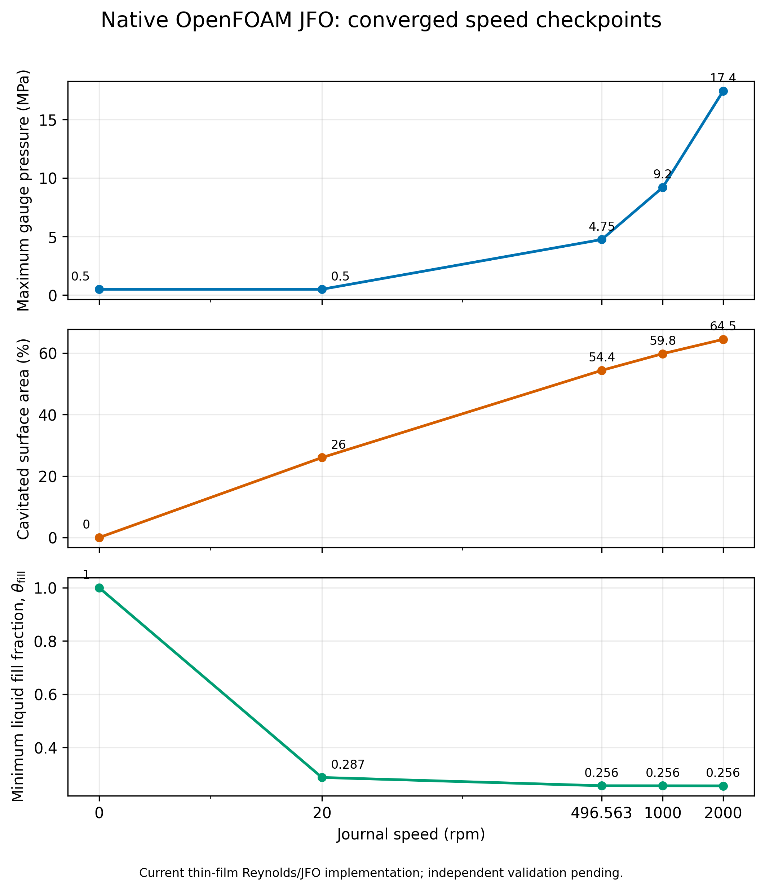
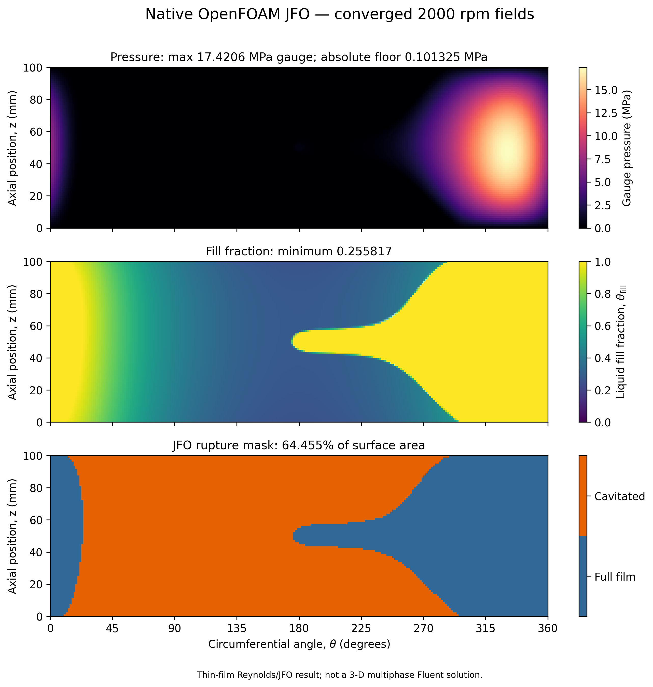
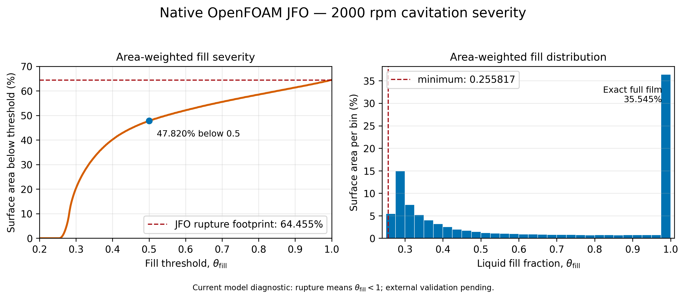
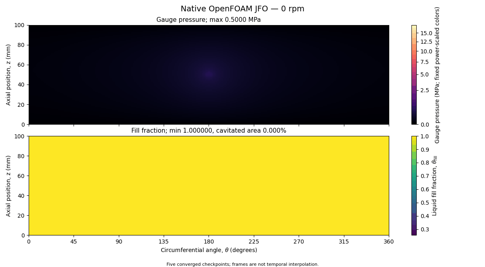

#+title: 14 - Native OpenFOAM Reynolds/JFO Candidate
#+startup: overview
#+options: toc:2 num:nil

[[file:13-guarded-2000rpm-ramp.org][Previous: guarded 3-D ramp]] | [[file:00-index.org][Index]]

* Status

#+begin_quote
UNVALIDATED NUMERICAL CANDIDATE.  Preserve and inspect this result, but do not
present its cavity fraction, load, flow, or torque as validated bearing
performance.
#+end_quote

The 3-D single-liquid OpenFOAM branch reached its declared saturation guard
near 20 rpm and could not be continued honestly to the paper's high-speed
points without rupture physics.  A separate native OpenFOAM application,
=jfoBearingFoam=, was therefore built on the unwrapped conical film
midsurface.  It solves a conservative Reynolds/JFO pressure--fill
complementarity problem with OpenFOAM finite-volume fields and matrices.

This is not a 3-D Navier--Stokes or VOF solution.  It is also not validated
merely because a separate Python implementation gives nearly the same
numbers: both implementations encode the same local equations, boundary
choices, and active-set policy.

* Source and reproducibility

| Artifact | Role |
|---+---|
| [[file:../../openfoam/jfoBearingFoam/jfoBearingFoam.C][jfoBearingFoam.C]] | native OpenFOAM finite-volume implementation |
| [[file:../../openfoam/cases/jfoPaperExact/][jfoPaperExact]] | 256 by 80 source case and physical inputs |
| [[file:../../openfoam/check_jfoBearingFoam.sh][check_jfoBearingFoam.sh]] | build plus zero-speed acceptance check |
| [[file:../../reynolds_jfo.py][reynolds_jfo.py]] | separate Python/SciPy implementation of the same model |
| [[file:../../tests/test_reynolds_jfo.py][test_reynolds_jfo.py]] | current minimal regression checks |
| =out/openfoam_jfo_native_256x80/= | ignored generated case, checkpoints, result ledger, and VTK |

The source case uses:

- length 100 mm, mean journal radius 50 mm, and cone semi-angle 10 degrees;
- radial clearance 50 micrometres and eccentricity 30 micrometres, so
  =epsilon = 0.6=;
- dynamic viscosity 0.0277 Pa s;
- a central 4 mm feed region at 0.5 MPa gauge;
- atmospheric axial edges and atmospheric JFO rupture pressure;
- 256 circumferential by 80 axial control volumes.

The paper separately states 2.6 m/s and 2000 rpm.  At the stated 50 mm mean
radius, 2.6 m/s is 496.563 rpm.  Both points were solved rather than silently
equated.

Run the durable zero-speed check from the repository root:

#+begin_src sh
bash openfoam/check_jfoBearingFoam.sh
#+end_src

Regenerate the saved plots and animations from the retained OpenFOAM fields:

#+begin_src sh
MPLCONFIGDIR=/tmp/jfo-matplotlib \
  .venv/bin/python openfoam/visualize_jfo.py
#+end_src

* Converged candidate result

The continuation =0 -> 20 -> 496.563 -> 1000 -> 2000 rpm= converged at each
stored point.  At 2000 rpm the 256 by 80 field reports:

| Quantity | Candidate value |
|---+---:|
| Minimum absolute pressure | 101,325 Pa |
| Maximum absolute pressure | 17,521,898 Pa |
| Maximum gauge pressure divided by 0.5 MPa | 34.8411 |
| Minimum fill fraction | 0.255817 |
| Area-weighted mean fill fraction | 0.635710 |
| Area classified as ruptured, =thetaFill < 1 - 1e-8= | 64.455% |
| Feed flow | 4.409971e-6 m3/s |
| Relative global flow imbalance | 4.76e-8 |
| Total force =(Fx,Fy,Fz)= | =(37045.810, 50425.411, -12113.821)= N |
| Journal torque | -9.688458 N m |
| Final convergence history | 1103 steps, 4.309 characteristic revolutions |

The minimum is the prescribed rupture floor and occurs over many cavity
cells.  The maximum cell is at approximately =theta=331.172 degrees= and
=z=0.048125 m=.

* Why the 64.455 percent cavity is a red flag

The large area is not a threshold-counting illusion:

| Diagnostic | Value |
|---+---:|
| Area with =thetaFill < 0.9= | 61.379% |
| Area with =thetaFill < 0.5= | 47.820% |
| Film-volume-weighted liquid-content deficit | 47.082% |
| Cavity-only area-weighted mean fill | 0.435 |
| Cavity-only film-volume-weighted mean fill | 0.377 |

Therefore the candidate predicts a broad and strongly depleted rupture
region.  Classical journal-bearing rupture commonly occupies much of the
diverging film, and =thetaMin= being close to the geometric
=hMin/hMax approximately 0.25= is an encouraging consistency observation.
Neither observation proves that this discretization, feed treatment, or
reformation boundary is correct.

The result remains blocked from engineering use until all of these pass:

1. a published mass-conserving JFO/Elrod--Adams benchmark with known pressure,
   rupture, and reformation results;
2. manufactured full-film solutions that isolate the transformed conical
   diffusion and Couette terms;
3. a minimum three-grid convergence study for pressure, load, flow, rupture
   boundary, and integrated liquid deficit;
4. local as well as global conservation checks;
5. complementarity residual checks in full-film and ruptured cells;
6. sensitivity to feed-patch discretization, axial boundaries, rupture
   pressure, and continuation step;
7. comparison with a calibrated 3-D Fluent phase-change or gas-ingestion
   model, with the models named as different physics.

* Saved diagnostics

- 
  and [[file:media/jfo_candidate/speed_sweep.pdf][vector PDF]]
- 
  and [[file:media/jfo_candidate/final_fields_2000rpm.pdf][vector PDF]]
- 
  and [[file:media/jfo_candidate/fill_severity_2000rpm.pdf][vector PDF]]
- [[file:media/jfo_candidate/converged_checkpoints.mp4][Five-checkpoint H.264 animation]]
  and 
- [[file:media/jfo_candidate/checkpoint_metrics.csv][Checkpoint metrics CSV]]

The animation contains five converged operating points, not time-resolved
interpolation between speeds.

* What the paper comparison does and does not establish

Figure 6b of the direct conical-bearing paper is the only close published
comparison currently used.  At =gamma=10 degrees=, =lambda=1=,
=epsilon=0.6=, and 2000 rpm, graph reading gives approximately
=Pmax/Ps=35.6= for its FEA curve and =32.0= for its Fluent curve.  The
candidate gives 34.841 using gauge pressure or 35.044 using absolute
pressure.

That agreement is useful but narrow.  It checks one maximum-pressure scalar
and does not validate the cavity topology, fill fraction, mass-conserving
front, load vector, feed flow, or torque.  The paper uses a Reynolds rupture
condition rather than the present active-set JFO implementation and does not
fully specify the CFD feed-port geometry.

* Relation to Fluent

Fluent's standard cavitation models are 3-D liquid--vapour mass-transfer
models.  Selecting one does not apply the same JFO pressure--fill
complementarity law.  A final Fluent run must therefore be labelled as one of:

- a calibrated 3-D phase-change/gas model used as an independent physical
  comparison; or
- a custom UDF/UDS implementation whose discrete equations and
  complementarity enforcement are separately verified.

The first option is the defensible near-term comparison.  The second is a
solver-development project, not a settings translation.

[[file:13-guarded-2000rpm-ramp.org][Previous: guarded 3-D ramp]] | [[file:00-index.org][Index]]
