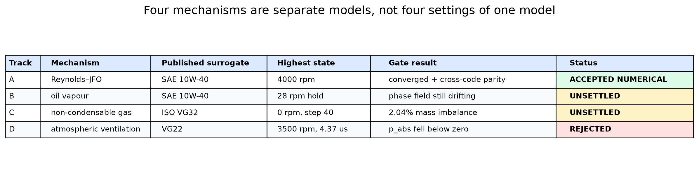
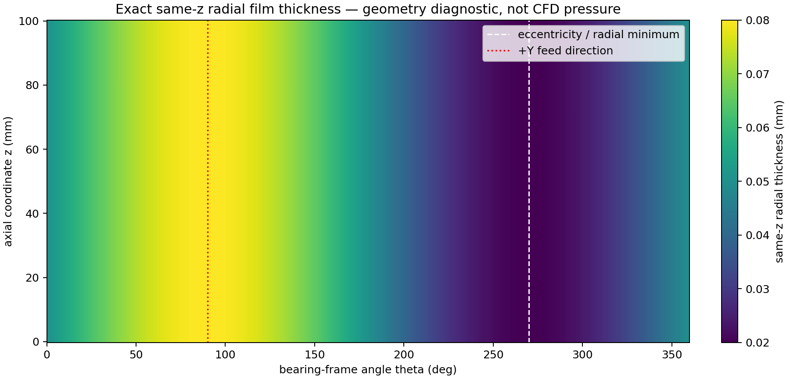
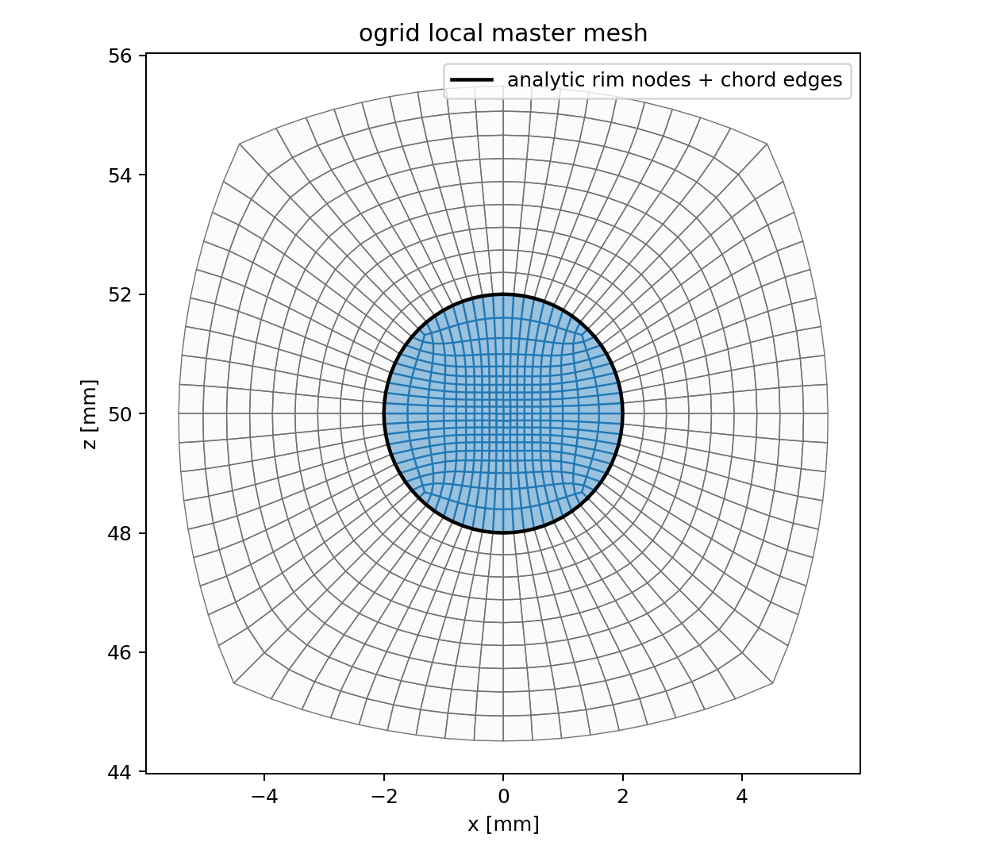
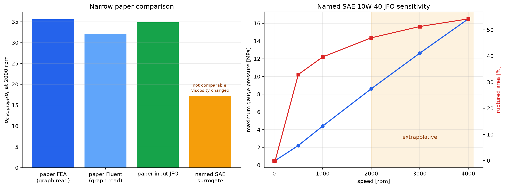
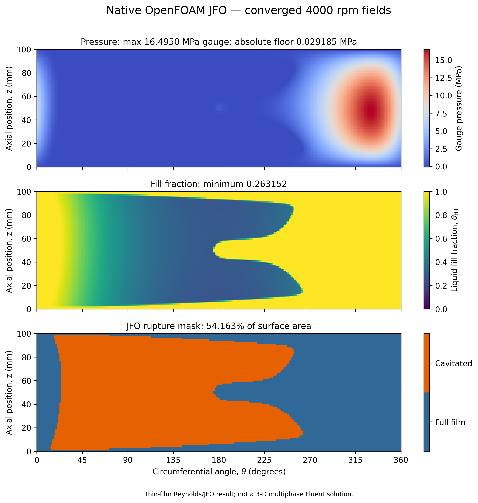
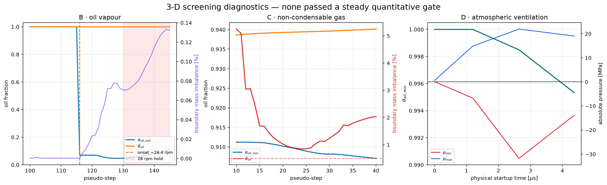
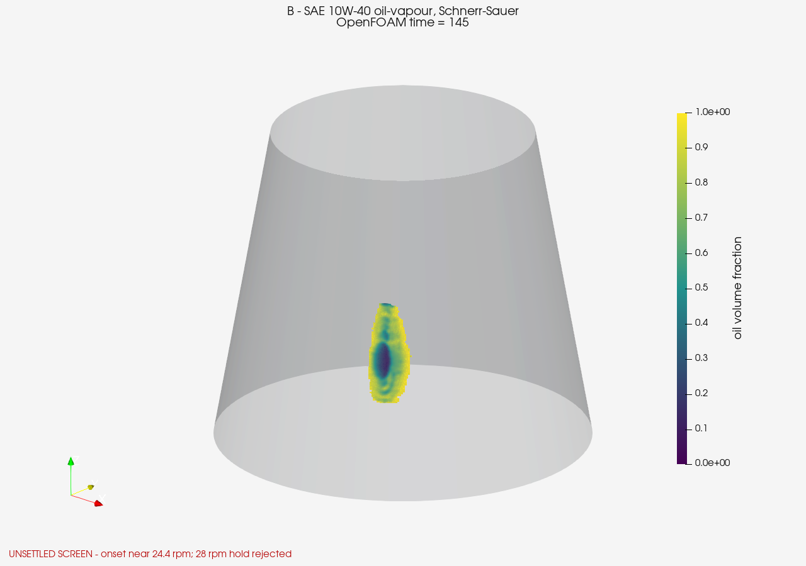
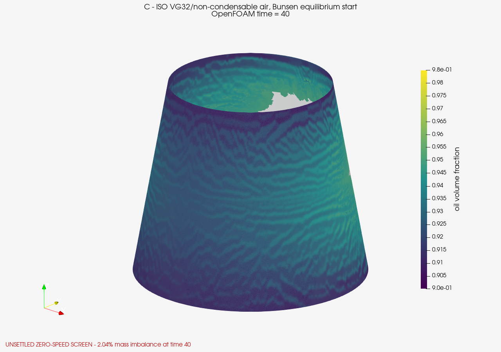
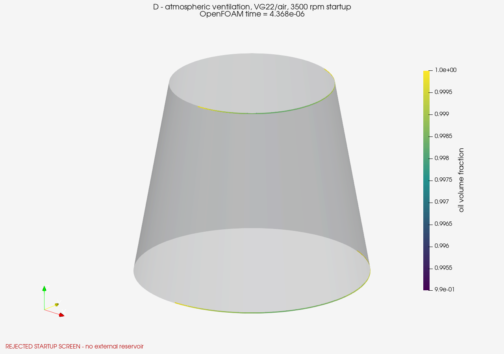

#+TITLE: Four-Track Cavitation Results and Professor Discussion
#+UPDATED_AT: [2026-07-30 Thu]
#+STARTUP: overview
#+OPTIONS: toc:2 num:nil

* Result boundary

Four physically different mechanisms were implemented and exercised on the
eccentric conical bearing.  They are not interchangeable settings of one
cavitation model.

| Track | Mechanism | Highest retained state | Status | Defensible use |
|---+---+---+---+---|
| A | mass-conserving Reynolds--JFO film rupture | 4000 rpm | accepted numerical sensitivity | pressure/fill trends, with validation caveats |
| B | oil-vapour phase change, Schnerr--Sauer | 28 rpm hold | unsettled | onset and solver-behaviour evidence only |
| C | compressible non-condensable gas | 0 rpm, pseudo-step 40 | unsettled | failed zero-speed gate only |
| D | atmospheric oil--air ventilation | 3500 rpm startup, 4.368 microseconds | physically rejected | boundary/startup failure evidence only |

Only Track A passed its declared numerical gates.  It remains an *unvalidated
numerical candidate*: native OpenFOAM and independent Python agreement tests
the implementation pair, not the shared physical assumptions.  Tracks B--D
must not be presented as converged high-speed cavitation predictions.

#+CAPTION: Status of the four executed mechanisms.
#+ATTR_ORG: :width 1100

* Geometry and boundary convention

** Direct conical-bearing geometry

| Quantity | Value used | Provenance or interpretation |
|---+---+---|
| bearing length | 100 mm | direct conical-bearing paper case |
| mean journal radius | 50 mm | direct paper |
| semi-cone angle | 10 degrees | selected direct-paper geometry |
| radial clearance, \(c\) | 0.05 mm = 50 micrometres | direct paper |
| eccentricity ratio, \(\epsilon=e/c\) | 0.6 | direct paper |
| eccentricity, \(e\) | 0.03 mm | \(0.6\times0.05\) mm |
| radial film-thickness range | 0.02--0.08 mm | \(c(1-\epsilon)\) to \(c(1+\epsilon)\) |
| pressure-feed diameter | 4 mm | circular surface patch |
| feed axial position | 50 mm | bearing mid-plane |
| feed pressure used | 601325 Pa absolute | assumes 0.5 MPa gauge |
| axial-end pressure | 101325 Pa absolute | atmospheric ends |
| gravity | zero | therefore VOF \(p_{rgh}=p\) |

The paper does not resolve whether 0.5 MPa is gauge or absolute or whether the
axial ends are flooded or air-accessible.  The values above are the declared
scenario used in these screens, not hidden facts recovered from the paper.

#+CAPTION: Exact same-z radial film thickness.  This is a geometry diagnostic, not a CFD pressure field.
#+ATTR_ORG: :width 1100

** Mesh actually used

Track A uses a reduced body-fitted conical midsurface mesh.  Tracks B--D use
the full three-dimensional O-grid film mesh.

| Check | Track A: Reynolds--JFO | Tracks B--D: 3-D VOF |
|---+---+---|
| topology | one-layer Hex8 midsurface representation | full Hex8 fluid volume |
| resolution | 256 x 80 background | 1,252,800 cells; 1,364,688 points |
| physical feed | 96 cells, 32 rim faces | 396 Quad4 feed faces |
| total cells | 20,640 | 1,252,800 |
| film-thickness layers | reduced model | 12 |
| minimum Fluent-equivalent OQ | 0.956754 | 0.922660 |
| mean Fluent-equivalent OQ | not used as acceptance scalar | 0.970117 |
| cells below OQ 0.9 | zero | zero |
| OpenFOAM standard check | maximum non-orthogonality 7.64865 degrees | =Mesh OK= in all three cases |

The 3-D boundary-face counts are 104400 =journal_wall=, 104004
=stationary_wall=, 396 =pressure_feed=, and 6912 on each axial opening.  The
mesh is extremely thin by design.  Standard =checkMesh= and the
Fluent-equivalent orthogonal-quality audit pass; an extended normalized
determinant warning must not be confused with a failed standard mesh check.

#+CAPTION: Accepted reduced Reynolds--JFO geometry and body-fitted 4 mm feed mesh.
#+ATTR_ORG: :width 1100
[[file:media/cavitation_four_track/geometry_mesh/accepted_geometry_and_mesh.png]]

#+CAPTION: Full 3-D conical mesh and orthogonal-quality projection through all 12 physical gap layers.
#+ATTR_ORG: :width 1100
[[file:media/oq90_3d/full_3d_fluent_oq_overview.png]]

#+CAPTION: Local O-grid construction around the 4 mm circular surface feed.
#+ATTR_ORG: :width 700

* Lubricants and simulation inputs

None of the substitute values below is relabelled as the conical paper's
unspecified V-32 oil.

** Tracks A and B: published SAE 10W-40 simulation surrogate

Muchammad et al. report a single internally named simulation set.  The paper
does not identify a commercial product or operating temperature.

| Property | Value |
|---+---|
| liquid density | 850 kg/m3 |
| liquid dynamic viscosity | 0.0125 Pa s |
| saturation/rupture pressure | 29185 Pa absolute |
| vapour density, Track B only | 10.95 kg/m3 |
| vapour dynamic viscosity, Track B only | \(2.0\times10^{-5}\) Pa s |

Track A uses only the liquid properties and 29185 Pa JFO pressure floor.  Track
B uses OpenFOAM 14 =incompressibleVoF= with native =VoFCavitation= and
Schnerr--Sauer.  Its explicit translation is:

| Schnerr--Sauer input | Value | Status |
|---+---+---|
| nuclei diameter, \(d_{nuc}\) | \(2.0\times10^{-6}\) m | twice the source's \(1\) micrometre Zwart radius |
| nuclei number density, \(n\) | \(1.19425920279\times10^{14}\) 1/m3 | calculated to reproduce source \(\alpha_{nuc}=5\times10^{-4}\) |
| condensation coefficient, \(C_c\) | 1 | OpenFOAM screening setting |
| vaporisation coefficient, \(C_v\) | 1 | OpenFOAM screening setting |
| surface tension | 0 N/m | declared homogeneous-mixture simplification; source omitted it |

The source reports the Zwart model with \(R_b=10^{-6}\) m,
\(\alpha_{nuc}=5\times10^{-4}\), \(F_{vap}=50\), and \(F_{cond}=0.01\).
OpenFOAM Foundation 14 has no native Zwart implementation in this installation,
so Track B is a documented Schnerr--Sauer screen, not a reproduction.

** Track C: ISO VG32 turbine oil and non-condensable air

Values are taken or evaluated from Wettmarshausen et al. (2025).

| Phase/property | Value |
|---+---|
| oil temperature | 50 degrees C |
| oil density | 837.1 kg/m3 |
| oil dynamic viscosity | 0.0236624469428 Pa s |
| oil heat capacity | 2140.2 J/(kg K) |
| oil conductivity | 0.134 W/(m K) |
| air reference density | 1.185 kg/m3 at 25 degrees C and 101325 Pa |
| air dynamic viscosity | \(1.83\times10^{-5}\) Pa s |
| air heat capacity | 1004.4 J/(kg K) |
| air conductivity | 0.0261 W/(m K) |
| Bunsen solubility coefficient | 0.09 |
| gas law | ideal gas |
| phase change | none |
| surface tension | 0 N/m, source-model simplification |

The source's pressure-dependent equation gives initial gas fraction
0.0161710714832 and oil fraction 0.983828928517 at 601325 Pa.  This is a
compressible free-gas/pseudo-cavitation model, not a dissolved-air desorption
model.

** Track D: VG22 oil and atmospheric air

Sakai, Ochiai, and Hashimoto (2019) provide:

| Phase/property | Value |
|---+---|
| VG22 oil density at 40 degrees C | 860 kg/m3 |
| VG22 oil dynamic viscosity at 40 degrees C | 0.019 Pa s |
| air density at 28 degrees C | 1.23 kg/m3 |
| air dynamic viscosity at 28 degrees C | \(1.75\times10^{-5}\) Pa s |
| measured oil--air surface tension | 0.04 N/m |
| phase change | none |
| initial film | completely oil-filled |
| feed backflow phase | pure oil |
| axial-end reverse-flow phase | pure air |

The source does not report wall contact angle, so the screen uses a
=zeroGradient= oil-fraction wall condition rather than inventing a wettability
value.  The current film-only mesh has no external reservoir or meniscus.

* Numerical controls actually run

| Track | Solver/time treatment | Coupling and limits | Interpretation |
|---+---+---+---|
| A | =jfoBearingFoam=; pseudo-step index | 256 circumferential divisions; at most 8 revolutions, 200 active-set iterations; convergence tolerance \(10^{-8}\), policy tolerance \(10^{-7}\) | converged steady Reynolds--JFO checkpoints |
| B | =incompressibleVoF=; =localEuler= | 1 outer and 2 pressure correctors; 2 alpha correctors, 2 MULES iterations; max Co 1, max alpha Co 0.5 | indices 0--145 are pseudo-steps, not physical seconds |
| C | =compressibleVoF=; =localEuler= | 1 outer and 3 pressure correctors; 2 alpha correctors, 2 MULES iterations; max Co 1, max alpha Co 0.5 | indices 0--40 are pseudo-steps, not physical seconds |
| D | =incompressibleVoF=; first-order =Euler= physical time | initial \(\Delta t=10^{-6}\) s, adaptive maximum \(10^{-5}\) s; max Co 0.3, max alpha Co 0.2; 1 outer and 3 pressure correctors | rejected startup was advanced to \(4.368\times10^{-6}\) s |

All 3-D cases were decomposed over four Scotch partitions.  The distinction
between B/C pseudo-time and D physical time is essential: their frame numbers
cannot be put on one common seconds axis.

* Numerical results

** Track A: Reynolds--JFO speed sensitivity

| Speed | Maximum gauge pressure | Minimum fill | Ruptured area |
|---+---+---+---|
| 0 rpm | 0.500000 MPa | 1.000000 | 0% |
| 20 rpm | 0.500000 MPa | 1.000000 | 0% |
| 496.563 rpm | 2.206270 MPa | 0.273684 | 32.9129% |
| 1000 rpm | 4.400088 MPa | 0.268618 | 39.6223% |
| 2000 rpm | 8.607458 MPa | 0.265566 | 46.9312% |
| 3000 rpm | 12.626763 MPa | 0.263936 | 51.2572% |
| 4000 rpm | 16.495019 MPa | 0.263152 | 54.1630% |

At 4000 rpm the feed flow is \(1.00125029\times10^{-5}\) m3/s.  Native
OpenFOAM and independent Python maximum pressure differ by no more than
0.0257% over the sweep.

#+CAPTION: Paper scalar comparison and named-oil JFO sensitivity through 4000 rpm.
#+ATTR_ORG: :width 1100

#+CAPTION: Pressure and fill fields at the final accepted 4000 rpm sensitivity point.
#+ATTR_ORG: :width 1100

The paper-input JFO run with \(\mu=0.0277\) Pa s gives
\(p_{max,gauge}/p_s=34.8411\) at 2000 rpm.  Graph-read values from Gangrade et
al. are approximately 35.6 for FEA and 32.0 for Fluent: differences of -2.13%
and +8.88%, respectively.  This is a one-scalar consistency check only.  The
new SAE 10W-40 value is not called a paper match because its viscosity differs.

The paper also states a surface speed of 2.6 m/s.  At 50 mm radius this is
496.6 rpm, not 2000 rpm; both points remain separate.

** Tracks B--D: screening outcomes

| Track | Preserved result | Gate outcome |
|---+---+---|
| B | onset near 24.4 rpm; at 28 rpm \(\alpha_{oil,min}=0.1111669\), mean 0.9989990, mass imbalance 0.1321% | pressure stayed near \(p_{sat}\), but phase field did not plateau; stop |
| C | zero speed, step 40: \(\alpha_{oil,min}=0.9070867\), mean 0.9401456, feed flow -0.0011828713 kg/s, net boundary flow \(-2.40724\times10^{-5}\) kg/s | 2.035% imbalance exceeded 0.5% gate; rotation not attempted |
| D | 20 rpm for \(10^{-5}\) s: interior \(\alpha_{oil,min}=0.999939\); 3500 rpm startup to 4.368 microseconds: final minimum 0.9953278 | worst absolute pressure -31.7571 MPa and maximum 21.9133 MPa; physically reject |

#+CAPTION: Time or pseudo-time diagnostics for the three 3-D screens.
#+ATTR_ORG: :width 1100

#+CAPTION: Track B oil-fraction and absolute-pressure fields at the final preserved 28 rpm hold.
#+ATTR_ORG: :width 900

#+CAPTION: Track C oil-fraction field at the failed zero-speed gate.
#+ATTR_ORG: :width 900

#+CAPTION: Track D oil-fraction field at the rejected 3500 rpm startup.
#+ATTR_ORG: :width 900

Static frames are not evidence of convergence.  The corresponding checkpoint
animations are:

- [[file:media/jfo_sae10w40/converged_checkpoints.mp4][Track A accepted checkpoints, MP4]]
- [[file:media/cavitation_four_track/track_b_vapour/phase_states.mp4][Track B oil-vapour states, MP4]]
- [[file:media/cavitation_four_track/track_c_gas/phase_states.mp4][Track C gas states, MP4]]
- [[file:media/cavitation_four_track/track_d_ventilation/phase_states.mp4][Track D ventilation states, MP4]]
- [[file:media/cavitation_four_track/track_d_ventilation/pressure_startup.mp4][Track D rejected pressure startup, MP4]]

* Professor-discussion position

** Short statement

We implemented all four interpretations rather than selecting a cavitation
model by name.  Reynolds--JFO passed its numerical gates and is the defensible
primary model for mass-conserving film rupture with the data currently
available.  Oil vapour reached phase onset but did not settle, the
non-condensable-gas case failed its zero-speed conservation gate, and
ventilation produced negative absolute pressure before air could propagate
through the film-only domain.  These are useful negative results, not failed
attempts to hide.

** Decisions still needed

1. Is the intended observable pressure/load, a visible gas cavity, oil vapour,
   dissolved-air release, or ambient-air ingestion?
2. What exact V-32 product and operating temperature belong to the rig?
3. Is the 0.5 MPa supply gauge or absolute?
4. Are the axial ends flooded, sealed, or open to air?
5. Can the rig/end/reservoir geometry and pressure-tap data be obtained?
6. If ventilation is intended, can oil--metal contact angle be measured?

** Next evidence, in order

1. Reproduce Gangrade's complete normalized pressure curve and experimental
   taps, not only peak pressure.
2. Run at least three consistent Reynolds--JFO meshes and report peak
   pressure, load, feed flow, rupture boundary, and liquid deficit.
3. Resume only the professor-selected 3-D mechanism after fixing its failed
   gate and obtaining the missing properties/boundary evidence.
4. Validate that 3-D mechanism on its own fully specified experimental
   benchmark before calling the combined conical result validated.

* Evidence and provenance

- Compact machine-readable ledger:
  [[file:media/cavitation_four_track/mechanism_summary.csv][mechanism_summary.csv]]
- Presentation cliff notes:
  [[file:media/cavitation_four_track/CLIFF_NOTES.md][CLIFF_NOTES.md]]
- Track A sources:
  [[file:../../out/openfoam_jfo_sae10w40_256x80/INPUT_SOURCES.md][INPUT_SOURCES.md]]
- Track B result:
  [[file:../../out/openfoam_oq90_vapour_sae10w40_schnerr_screen/RUN_RESULTS.md][RUN_RESULTS.md]]
- Track C result:
  [[file:../../out/openfoam_oq90_pseudocavitation_iso_vg32_air/RUN_RESULTS.md][RUN_RESULTS.md]]
- Track D result:
  [[file:../../out/openfoam_oq90_ventilation_vg22_air_boundary_screen/RUN_RESULTS.md][RUN_RESULTS.md]]
- Full 3-D mesh manifest:
  [[file:../../out/paper_exact_current_circular_ogrid_3d_oq90/manifest.json][manifest.json]]

Literature used for the surrogate values and interpretation:

- [[https://doi.org/10.1007/s40997-018-0217-2][Gangrade, Phalle, and Mantha (2019)]] -- direct conical-bearing geometry and comparison.
- [[https://jurnaltribologi.mytribos.org/v40/JT-40-39-60.pdf][Muchammad et al. (2024)]] -- SAE 10W-40 simulation surrogate.
- [[https://doi.org/10.3390/lubricants13040140][Wettmarshausen et al. (2025)]] -- non-condensable-gas model and ISO VG32 values.
- [[https://doi.org/10.3390/lubricants7090074][Sakai, Ochiai, and Hashimoto (2019)]] -- VG22 oil--air VOF values.
- [[https://doi.org/10.1115/1.4002215][Giacopini et al. (2010)]] and
  [[https://doi.org/10.1115/1.4034244][Miraskari et al. (2017)]] -- JFO complementarity benchmarks.
